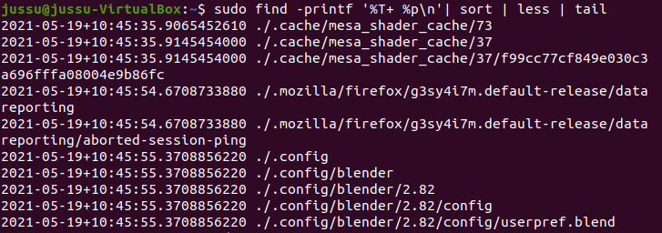

# Harjoitus 7

## b) oma moduuli

**Johdanto**

Tein moduulin, jolla voin asentaa puhtaalle linuxille sovelluksia, joita käytän itse usein. Moduuli asentaa Firefoxin, Blenderin, Discordin ja Spotifyn. Moduuli myös muuttaa blenderissä teeman automaattisesti kaikille käyttäjille ja oletussivun firefoxiin. Ajattelin, että tästä projektista olisi hyötyä myöhemmin, jos päätän asentaa linux desktopin uudelleen. 

Aloitin projektin tekemällä salttiin moduulille kansion. Tein kansioon init.sls tiedoston, johon myöhemmin laitan kaiken tavaran. Aloitin asentamalla firefoxin käsin, jotta voisin kopioida konfigurointitiedoston, johon voin muuttaa oletussivun duckduckgo.com. Aloitin init.sls tiedoston täyttämisen asentamalla ensin firefoxin ja muutaman hyötyohjelman, joita tulen käyttämään myöhemmin. Laitoin myös tarvittavan koodin, jotta saan file.managedin toimimaan. Laitoin tässä vaiheessa sls tiedostoon seuraavan koodin.

	tools:
	  pkg.installed:
	    - pkgs:
	      - curl
   	      - firefox
	      - tree
	      - git
	      
	/etc/firefox/syspref.js:
  	  file.managed:
 	    - source: salt://projekti/syspref.js

Tässä vaiheessa kaikki toimi moitteetta. Testasin avata firefoxin ja duckduckgo.com aukesi niin kuin pitikin. 

Seuraavaksi asensin Blenderin ensin käsin, jotta voin muokata sen haluamakseni ja ottaa siitä tarvittavat konfigurointitiedostot. Asensin sen sudo apt install blender ja avasin sen. Vaihdoin taustaa tummemmaksi, koska se on minun mielestäni mukavampi. 

Kun olin muuttanut asetuksia käytin find komentoa löytääkseni muutetut asetustiedostot komennolla: "find -printf '%T+ %p\n'|sort|tail". Kopioin konfigurointitiedoston salttiin, jonka jälkeen poistin blenderin. Tein sls tiedostoon muutoksia lisäämällä sinne blenderin asennuksen ja konfigurointitiedostoa varten file.managedin. init.sls tiedoston sisältö:

	tools:
	  pkg.installed:
	    - pkgs:
	    - curl
	    - firefox
	    - tree
	    - git
	/etc/firefox/syspref.js:
	  file.managed:
	    - source: salt://projekti/syspref.js

	blender:
	  pkg.installed
  
	/etc/skel/userpref.blend:
	  file.managed:
	    - source: salt://projekti/userpref.blend
	    
Discordin asennus

Asensin Spotifyn ensiksi käsin, jonka tekemiseen [käytin Spotifyn omilta sivuilta löytyvää ohjetta](https://www.spotify.com/fi/download/linux/) ja [Jesperikuulan tehtäväraporttia](https://jesperikuula.wordpress.com/palvelinten-hallinta-viikko-4/). Lisäsin spotify listan ja avaimen seuraavilla komennoilla.

	curl -sS https://download.spotify.com/debian/pubkey_0D811D58.gpg | sudo apt-key add - 
	echo "deb http://repository.spotify.com stable non-free" | sudo tee /etc/apt/sources.list.d/spotify.list
	
Nämä komennot lisäävät spotifyn paketin linuxin paketinhallintajärjestelmään. Seuraavaksi päivitetään pakettilista ja asennetaan spotify-client.

	sudo apt update
	sudo apt install spotify-client
	

## Moduulin kokeilu uudella koneella. 

-tehtävä on hieman kesken, mutta saan sen valmiiksi ennen torstain tuntia- -kuvat ja pari osaa puuttuu-

## Lähteet

https://linuxconfig.org/how-to-install-discord-on-ubuntu-18-04-bionic-beaver-linux

https://askubuntu.com/questions/506909/how-can-i-accept-the-lience-agreement-for-steam-prior-to-apt-get-install

https://www.spotify.com/fi/download/linux/

https://jesperikuula.wordpress.com/palvelinten-hallinta-viikko-4/
